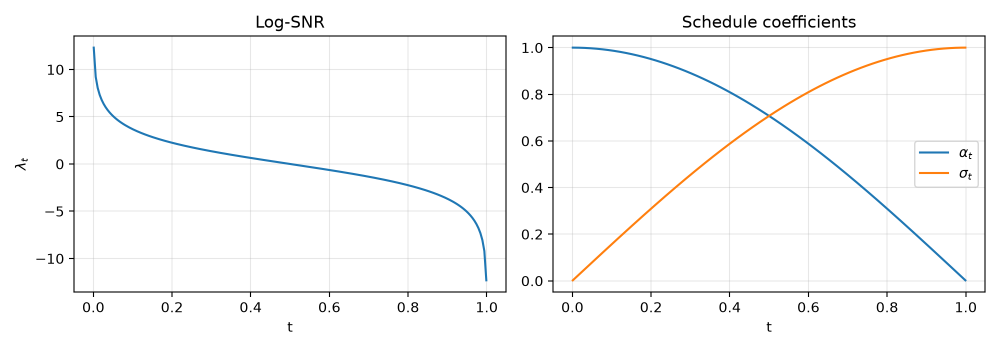
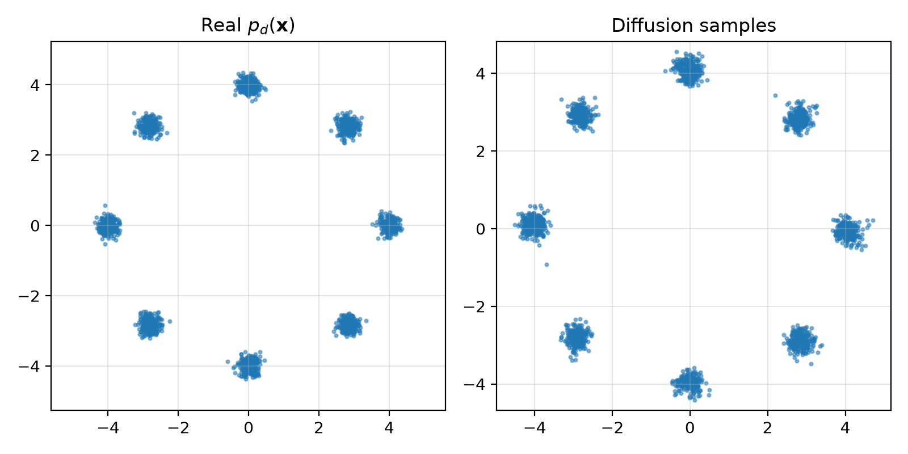

# Diffusion Sampling

This repository contains diffusion sampling, including a clean Python implementation of a score-based diffusion model on a 2D dataset and notebook explorations.

The current structured implementation trains a score network on a ring-of-Gaussians target distribution using a cosine log-SNR noise schedule and v-parameterisation.

## Repository structure

```text
Diffusion_Sampling/
│
├── src/
│   └── score_matching_snr_reparametrization/
│       ├── device.py             # set_seed, DEVICE, print_device
│       ├── data.py               # 2D points data from mixture of Gaussian organised in ring
│       ├── cos_schedule.py       # cosine noise schedule
│       ├── embeddings.py         # Fouerier feature embedding for time or noise level
│       ├── model.py              # MLP NN model
│       ├── parameterisation.py   # v-reparametrization; epsilon-reparametrization
│       ├── loss.py               # diffusion loss
│       ├── sampling.py           # generate samples
│       ├── training.py           # train MLP NN model to minimize diffusion loss
│       ├── plotting.py           # plot functions for 2D Gaussian points visualisation
|       |
|       ├── image_data.py         # image data
|       ├── UNet_model.py         # UNet NN model
|       ├── image_training.py     # train UNet NN model to minimize diffusion loss
|       └── image_plotting.py     # plot functions for image visualisation
│
├── scripts/
│   ├── train_diffusion_model.py  # execute the training, save check-point to output
│   ├── generate_samples.py       # execute the sample generation via trained NN model, load check-point
|   |
|   ├── train_UNet.py             # execute the training of UNet
|   └── generate_image_samples.py # execute the sample generation of MNIST
│ 
├── outputs/
│   ├── checkpoints/
│   │   └── score_mlp_v.pt        # saved check-points during training
│   └── figures/
│       ├── true_distribution.png 
│       ├── noise_schedule.png    # cosine log snr noise schedule, change of log_snr with t
│       └── real_vs_generated.png # compare the real samples and the generated samples
│
├── notebooks/
│   ├── Denoising_Diffusion_1.ipynb
│   ├── Denoising_Diffusion_2_Image.ipynb
│   ├── Diffusion.ipynb
│   ├── Diffusion_vs_Optimal_Transport.ipynb
│   ├── Low_dimensional_Diffusion.ipynb
│   └── Score_based_Diffusion.ipynb
│
├── requirements.txt
├── pyproject.toml
└── README.md
```

## Installation

Clone the repository:

```bash
git clone https://github.com/xc308/Diffusion_Sampling.git
cd Diffusion_Sampling
```

Create and activate a virtual environment:

```bash
python3 -m venv .venv
source .venv/bin/activate
```

Install dependencies:

```bash
pip install -r requirements.txt
```

Install the local package in editable mode:

```bash
pip install -e .
```

## Train the diffusion model

Run:

```bash
python scripts/train_diffusion_model.py
```

This trains the MLP diffusion model and saves a checkpoint to:

```text
outputs/checkpoints/score_mlp_v.pt
```

## Generate samples

After training, run:

```bash
python scripts/generate_samples.py
```

This loads the saved checkpoint and generates samples from the trained diffusion model.

## Example outputs

### Noise schedule



### Real samples versus generated samples



## Notes

The notebooks contain broader exploratory work on diffusion models, denoising diffusion, score-based diffusion, and connections with sampling and optimal transport.

